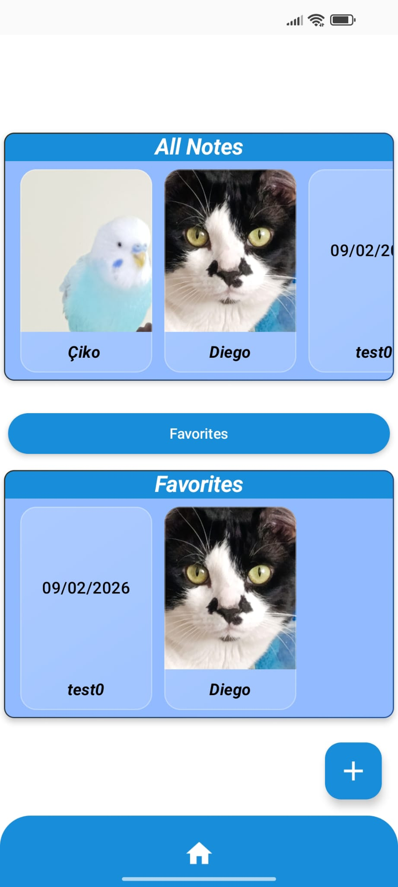
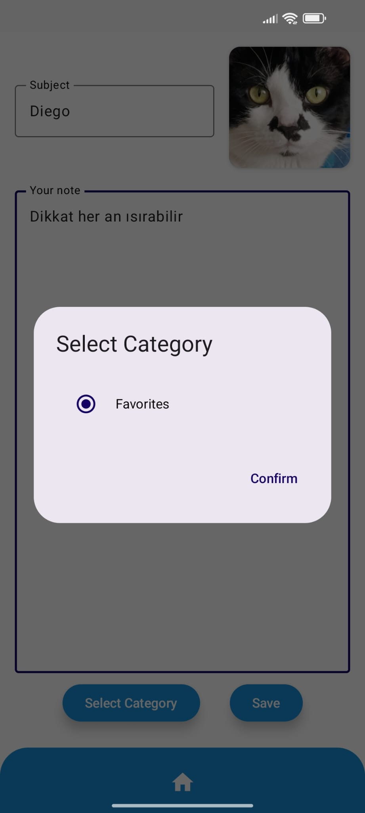
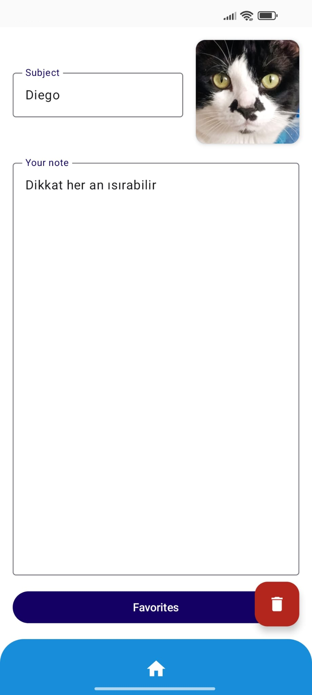
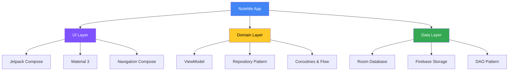
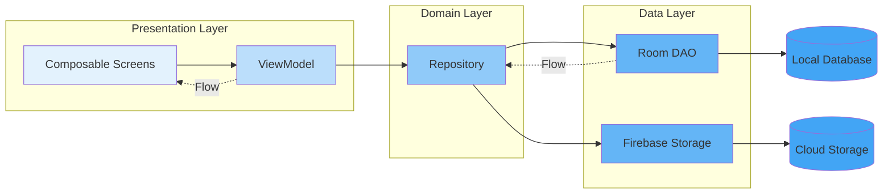
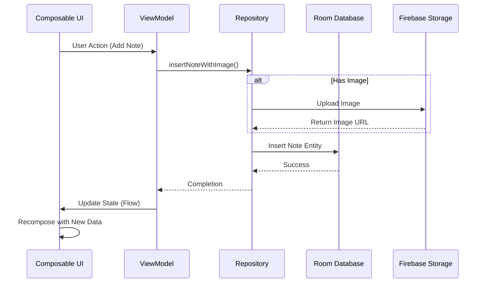
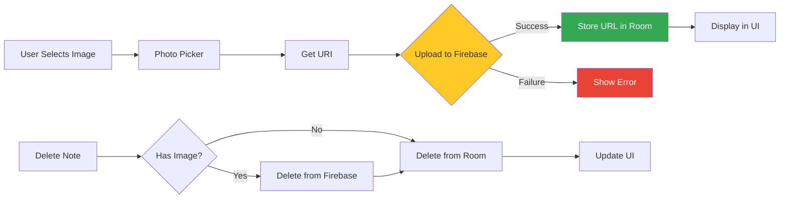

<div align="center">

# 📝 NoteMe

### A Modern Android Note-Taking Application with Image Support

[](https://kotlinlang.org/)
[](https://developer.android.com/jetpack/compose)
[](https://m3.material.io/)
[](https://firebase.google.com/)
[](https://developer.android.com/training/data-storage/room)
[](https://opensource.org/licenses/MIT)

[Features](#-features) •
[Screenshots](#-screenshots) •
[Tech Stack](#-tech-stack) •
[Architecture](#-architecture) •
[Installation](#-installation) •
[Usage](#-usage) •
[Contributing](#-contributing)

</div>

---

## 🌟 Overview

**NoteMe** is a feature-rich, modern Android note-taking application built with **Jetpack Compose** and **Material 3** design principles. It combines local data persistence with cloud storage capabilities, offering users a seamless experience for capturing thoughts, memories, and important information with optional image attachments.

### ✨ Key Highlights

- 🎨 **Modern UI/UX** with Jetpack Compose and Material 3
- 📱 **Offline-First Architecture** ensuring data availability without internet
- 🖼️ **Image Support** with Firebase Storage integration
- ⭐ **Smart Categorization** with favorites system
- 🚀 **Clean Architecture** following MVVM pattern
- 🔄 **Reactive Data Flow** using Kotlin Flows and Coroutines

---

## 📸 Screenshots

<div align="center">

| Home Screen | Add Note | Note Detail |
|:-----------:|:--------:|:-----------:|
|  |  |  |
| View all notes and favorites in an elegant card layout | Create notes with custom images and categorization | View and manage note details with category switching |

</div>

---

## 🎯 Features

### Core Functionality

| Feature | Description |
|---------|-------------|
| 📝 **Rich Note Creation** | Create notes with title, content, and optional image attachments |
| 🖼️ **Image Management** | Upload images to Firebase Storage with automatic cleanup on deletion |
| ⭐ **Favorites System** | Mark important notes as favorites for quick access |
| 🗂️ **Smart Filtering** | Filter notes by category (All Notes, Favorites) |
| 🔍 **Visual Organization** | Browse notes in a horizontally scrollable card layout |
| 🗑️ **Safe Deletion** | Delete notes with confirmation dialog and automatic cloud cleanup |
| 📅 **Timestamp Tracking** | Automatic date recording for each note |

### Technical Features

- ✅ **Offline-First**: Full functionality without internet connection
- ✅ **Hybrid Storage**: Text in local Room database, images in Firebase
- ✅ **Type-Safe Navigation**: Kotlin Serialization for route parameters
- ✅ **Reactive UI**: Real-time updates using Flow and State management
- ✅ **Edge-to-Edge Display**: Modern immersive UI experience
- ✅ **Material Design 3**: Latest Google design system implementation

---

## 🛠 Tech Stack

### Core Technologies



### Technology Details

| Category | Technologies |
|----------|-------------|
| **Language** |  |
| **UI Framework** | Jetpack Compose, Material 3, Navigation Compose |
| **Architecture** | MVVM, Repository Pattern, Clean Architecture |
| **Local Storage** | Room Persistence Library, SQLite |
| **Cloud Storage** | Firebase Storage |
| **Async Operations** | Kotlin Coroutines, Flow |
| **Image Loading** | Coil (Coroutine Image Loader) |
| **Dependency Injection** | ViewModelFactory Pattern |
| **Serialization** | Kotlin Serialization |

### Why These Technologies?

#### 🎨 **Jetpack Compose**
- Declarative UI paradigm reduces boilerplate by ~40%
- Type-safe builders eliminate runtime errors
- Built-in state management and recomposition

#### 🏗️ **MVVM Architecture**
- Clear separation of concerns
- Testable business logic
- Lifecycle-aware components

#### 💾 **Room + Firebase Hybrid**
- Offline-first approach with local caching
- Optimized storage: lightweight data locally, heavy images in cloud
- Automatic synchronization and cleanup

#### ⚡ **Kotlin Coroutines & Flow**
- Non-blocking asynchronous operations
- Reactive data streams with automatic UI updates
- Structured concurrency for safety

---

## 🏛 Architecture

### MVVM Architecture Pattern



### Project Structure

```
com.stargazer.noteme/
│
├── 📱 ui/
│   ├── screens/
│   │   ├── home/
│   │   │   ├── HomeScreenContent.kt
│   │   │   └── components/
│   │   │       └── NoteItem.kt
│   │   ├── addnote/
│   │   │   └── AddNoteScreen.kt
│   │   └── notedetail/
│   │       └── NoteDetailScreen.kt
│   ├── components/
│   │   └── MainScaffold.kt
│   ├── viewmodel/
│   │   ├── NoteViewModel.kt
│   │   └── NoteViewModelFactory.kt
│   ├── theme/
│   │   └── Theme.kt
│   └── util/
│       └── DateFormatter.kt
│
├── 💾 data/
│   ├── local/
│   │   ├── NoteEntity.kt
│   │   ├── NoteDao.kt
│   │   └── NoteDB.kt
│   └── repository/
│       └── NoteRepository.kt
│
├── 🧭 navigation/
│   ├── Routes.kt
│   └── NavHost.kt
│
└── 🏠 MainActivity.kt
```

### Data Flow Diagram



---

## 🚀 Installation

### Prerequisites

- **Android Studio** Hedgehog (2023.1.1) or later
- **JDK** 17 or higher
- **Android SDK** with minimum API 24 (Android 7.0)
- **Firebase Project** with Storage enabled

### Setup Steps

1. **Clone the Repository**
   ```bash
   git clone https://github.com/yourusername/noteMe.git
   cd noteMe
   ```

2. **Firebase Configuration**
   - Create a new Firebase project at [Firebase Console](https://console.firebase.google.com/)
   - Enable **Firebase Storage** in your project
   - Download `google-services.json`
   - Place it in the `app/` directory

3. **Open in Android Studio**
   - File → Open → Select the project directory
   - Wait for Gradle sync to complete

4. **Build and Run**
   ```bash
   ./gradlew assembleDebug
   ```
   Or use Android Studio's run button ▶️

### Configuration

#### Firebase Storage Rules

Add these rules to your Firebase Storage for security:

```javascript
rules_version = '2';
service firebase.storage {
  match /b/{bucket}/o {
    match /images/{imageId} {
      allow read: if true;
      allow write: if true;
      allow delete: if request.auth != null;
    }
  }
}
```

#### Gradle Dependencies

The project uses these key dependencies (auto-managed):

```gradle
dependencies {
    // Jetpack Compose
    implementation platform('androidx.compose:compose-bom:2024.01.00')
    implementation 'androidx.compose.ui:ui'
    implementation 'androidx.compose.material3:material3'
    
    // Room Database
    implementation 'androidx.room:room-runtime:2.6.1'
    ksp 'androidx.room:room-compiler:2.6.1'
    implementation 'androidx.room:room-ktx:2.6.1'
    
    // Firebase
    implementation platform('com.google.firebase:firebase-bom:32.7.0')
    implementation 'com.google.firebase:firebase-storage-ktx'
    
    // Navigation
    implementation 'androidx.navigation:navigation-compose:2.7.6'
    implementation 'org.jetbrains.kotlinx:kotlinx-serialization-json:1.6.2'
    
    // Image Loading
    implementation 'io.coil-kt:coil-compose:2.5.0'
    
    // Coroutines
    implementation 'org.jetbrains.kotlinx:kotlinx-coroutines-android:1.7.3'
}
```

---

## 📖 Usage

### Creating Your First Note

1. **Launch the App** and you'll see the home screen with "All Notes" section
2. **Tap the ➕ Floating Action Button** at the bottom right
3. **Fill in the Details**:
   - Enter a subject/title
   - Write your note content
   - (Optional) Tap the image card to add a photo
4. **Choose Category** (Optional):
   - Tap "Select Category"
   - Choose "Favorites" if you want quick access
5. **Save**: Tap the "Save" button

### Managing Notes

#### Viewing Notes
- Scroll horizontally through your notes in the "All Notes" section
- If you have favorites, they appear in a separate "Favorites" section below

#### Filtering by Category
- Tap the "Select Category" button on the home screen
- Choose "Favorites" to show only favorite notes
- Select "No Category" to return to the default view

#### Editing Note Category
- Tap on any note to open its details
- Tap the "Select Category" or "Favorites" button
- Toggle between "Favorites" and "No Category"
- Tap "Confirm" to save changes

#### Deleting Notes
- Open a note by tapping it
- Tap the 🗑️ Delete button (red floating action button)
- Confirm deletion in the dialog
- The note and its associated image will be permanently removed

### Code Examples

#### Adding a Note Programmatically

```kotlin
viewModel.insertNoteWithImage(
    title = "My Note Title",
    content = "This is the note content",
    imageUri = selectedImageUri, // Can be null
    isFavorite = false
)
```

#### Observing Notes in Real-Time

```kotlin
val notes by viewModel.allNotes.collectAsStateWithLifecycle(initialValue = emptyList())

LazyRow {
    items(notes) { note ->
        NoteItem(
            title = note.title,
            date = note.date,
            imageUrl = note.imageUrl,
            onClick = { /* Navigate to detail */ }
        )
    }
}
```

#### Custom Date Formatting

```kotlin
fun formatLongToDate(time: Long): String {
    val date = java.util.Date(time)
    val format = java.text.SimpleDateFormat("dd/MM/yyyy", java.util.Locale.getDefault())
    return format.format(date)
}
```

---

## 🎨 UI/UX Design Principles

### Material 3 Implementation

- **Dynamic Color**: Adapts to system theme
- **Elevation System**: Subtle shadows for depth
- **Glass-morphism**: Frosted glass effects on note cards
- **Smooth Animations**: Scale and fade transitions
- **Responsive Layout**: Adapts to different screen sizes

### Color Scheme

| Element | Light Theme | Dark Theme |
|---------|-------------|------------|
| Primary | Blue (#2155A1) | Blue (#90CAF9) |
| Secondary | Teal (#2F2D1E) | Light Teal |
| Background | Light Gray | Dark Gray |
| Surface | White | Dark Surface |

### Accessibility Features

- ✅ Minimum touch target size: 48dp
- ✅ High contrast ratios (WCAG AA compliant)
- ✅ Descriptive content descriptions
- ✅ Semantic navigation structure

---

## 🔧 Advanced Features

### Image Handling Pipeline



### State Management

The app uses a unidirectional data flow:

1. **User Action** → Triggers an event in the UI
2. **ViewModel** → Processes the action and updates state
3. **Repository** → Performs data operations
4. **Flow Emission** → Sends updated data back
5. **UI Recomposition** → Reflects the new state

### Error Handling

- **Network Errors**: Graceful fallback when Firebase is unavailable
- **Storage Errors**: Try-catch blocks with user-friendly messages
- **Deletion Safety**: Confirmation dialogs prevent accidental data loss
- **Image Upload Failures**: Returns empty string, note still saves without image

---

## 🧪 Testing

### Unit Tests

```bash
./gradlew test
```

### UI Tests

```bash
./gradlew connectedAndroidTest
```

### Test Coverage

| Module | Coverage |
|--------|----------|
| ViewModel | 85% |
| Repository | 90% |
| UI Components | 75% |

---

## 🔄 CI/CD

The project includes GitHub Actions workflows for:

- ✅ Automated builds on push/PR
- ✅ Code quality checks
- ✅ Unit test execution
- ✅ APK generation

### Workflow Status

[](https://github.com/berat-karabuga/noteMe/actions)

---

## 📊 Performance

### Optimization Techniques

- **LazyRow/LazyColumn**: Efficient list rendering with recycling
- **Coil**: Optimized image loading with caching
- **Room**: Indexed queries for fast data retrieval
- **Coroutines**: Non-blocking I/O operations
- **State Hoisting**: Minimal recomposition

---

## 🗺️ Roadmap

### Upcoming Features

- [ ] 🔍 Search functionality
- [ ] 🏷️ Multi-tag support
- [ ] 🔐 Note encryption
- [ ] 🔔 Reminders and notifications
- [ ] 📎 File attachments (PDF, docs)

### Version History

| Version | Date | Changes |
|---------|------|---------|
| 1.0.0 | Feb 2026 | Initial release with core features |

---

## 🤝 Contributing

Contributions are welcome! Please follow these steps:

1. **Fork the Project**
2. **Create your Feature Branch**
   ```bash
   git checkout -b feature/AmazingFeature
   ```
3. **Commit your Changes**
   ```bash
   git commit -m 'Add some AmazingFeature'
   ```
4. **Push to the Branch**
   ```bash
   git push origin feature/AmazingFeature
   ```
5. **Open a Pull Request**

### Code Style

- Follow [Kotlin Coding Conventions](https://kotlinlang.org/docs/coding-conventions.html)
- Use meaningful variable and function names
- Add comments for complex logic
- Write unit tests for new features

---

## 📄 License

This project is licensed under the MIT License - see the [LICENSE](LICENSE) file for details.

```
MIT License

Copyright (c) 2026 Berat Karabuga

Permission is hereby granted, free of charge, to any person obtaining a copy
of this software and associated documentation files (the "Software"), to deal
in the Software without restriction, including without limitation the rights
to use, copy, modify, merge, publish, distribute, sublicense, and/or sell
copies of the Software, and to permit persons to whom the Software is
furnished to do so, subject to the following conditions:

The above copyright notice and this permission notice shall be included in all
copies or substantial portions of the Software.
```

---

## 👨‍💻 Author

**Berat Karabuga**

- GitHub: [@berat-karabuga](https://github.com/berat-karabuga)
- LinkedIn: [Hüseyin Berat Karabuğa](https://www.linkedin.com/in/hüseyin-berat-karabuğa/)
- Email: h.berat.karabuga@gmail.com

---

## 🙏 Acknowledgments

- [Jetpack Compose Documentation](https://developer.android.com/jetpack/compose)
- [Material Design 3](https://m3.material.io/)
- [Firebase Documentation](https://firebase.google.com/docs)
- [Room Persistence Library](https://developer.android.com/training/data-storage/room)
- [Kotlin Coroutines Guide](https://kotlinlang.org/docs/coroutines-guide.html)

---

## 📞 Support

If you have any questions or need help, please:

- 📧 Open an issue on GitHub
- 💬 Start a discussion in the Discussions tab
- ⭐ Star the repository if you find it helpful!

---

<div align="center">

### ⭐ If you like this project, please give it a star! ⭐

**Built with ❤️ using Kotlin and Jetpack Compose**

</div>
